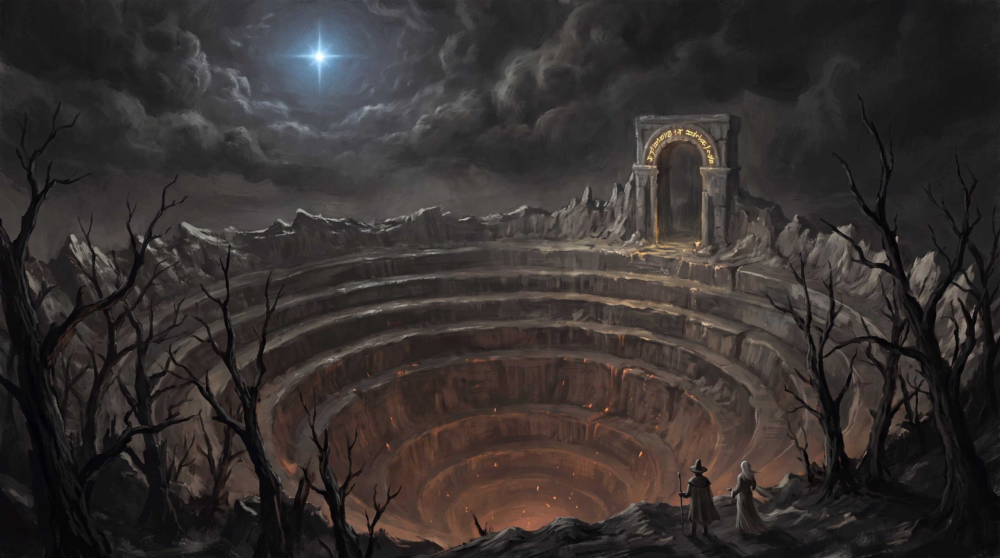

# NINE CIRCLES — a descent

**Play it: https://kylefriesmarketing.github.io/nine-circles/**

A branching-storybook descent through Dante's *Inferno* (Longfellow's 1867 translation —
the complete public-domain text ships in [`text/`](text/)). You wake midway upon the
journey of your life, hire a dead Roman poet, and walk down through all nine circles.
Hell is a bureaucracy of appetites: it reads you, it remembers you, and it will offer
you exactly the thing you cannot refuse.

## How it plays
- **The Sin Ledger** — seven sins accrue from your choices. Hell tailors its
  temptations: deadly choices *gleam* when a circle matches your ledger, and Minos
  reads your record on return visits.
- **Remembrance** — the damned beg to be retold above. You carry **three names per
  descent**; they inscribe on the Witness Wall only if you leave alive. Nine souls
  (the ninth is your guide) open the way past the stars.
- **Verses as wards** — real Longfellow tercets are collectible keys. One of them is
  the only thing that makes Ugolino stop gnawing and speak.
- **Beatrice's Star** — grace. Lies dim it, even kind ones. When it gutters, Hell
  starts lying back: the text itself corrupts, and the stars you exit under may be
  painted ones.
- **The Heart** — weep too freely and Hell keeps you; harden too far and what climbs
  out isn't you. The true ending demands the poet's stance: *feel it, and walk on.*
- **Punish / Absolve** — wrestle Death for his scythe in the dark wood, or spend
  candles of the star to undo knots of Hell. Both have consequences. And endings.
- **Hell remembers** — souls recognize returning pilgrims by your last verdict on
  them. Every descent is archived in the Tapestry.

**31 endings.** Three of them are above the clouds.

## Controls
`m` music · `n` echoes · `t` text unfurl · `~` debug lantern ·
`?node=n_gate&name=You` boots any scene

## Running locally
Any static server from the repo root, e.g. `python -m http.server` — then open
`index.html`. No build, no dependencies.

## Credits
- Text: Dante Alighieri, *The Divine Comedy*, tr. Henry Wadsworth Longfellow
  (1867), via [Project Gutenberg](https://www.gutenberg.org/ebooks/1004)
- Design, writing, code, score: built with Claude (Fable 5)
- Scene paintings & illuminated medallions: generated with Higgsfield
  (nano_banana_pro), sliced from 4K sheets
- Made by [@kylefriesmarketing](https://github.com/kylefriesmarketing)
